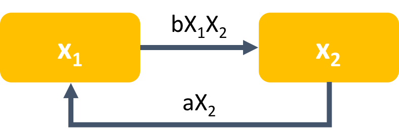
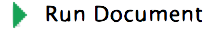
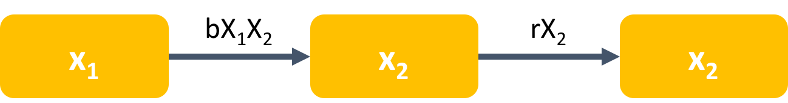
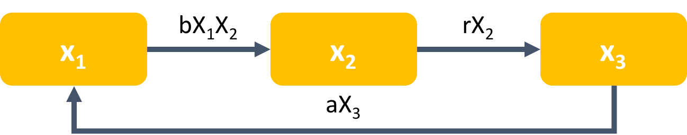
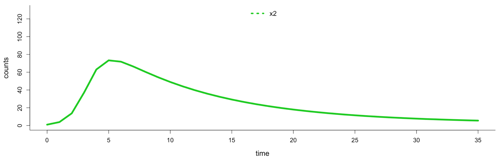

---

```{r setup, include=FALSE}
knitr::opts_chunk$set(echo = TRUE)
library(deSolve)
```

### Software and R packages installation and working directory setup.
Please make sure you downloaded the following software and R packages.

* Software:
    
    + [Netlogo](https://ccl.northwestern.edu/netlogo/download.shtml) (for Problem 1)
    
    + [R](https://cran.r-project.org/mirrors.html) (for Problem 2)
    
    + We also recommend that the registrants download [RStudio](https://www.rstudio.com/products/rstudio/download/#download) (free version)

* R packages:
    
    + `knitr`, `shiny`, `Matrix`, `deSolve`, `EpiModel`, `ggplot2`
    
    + To install these packages, just type the following command into the RStudio or R console to install all of the packages: `install.packages (c("shiny","knitr","Matrix","deSolve","EpiModel","ggplot2"))`
    
    + You can also click **Tools > Install Packages** in RStudio, and then key in the package names. The packages will be automatically downloaded.
    
* Set working directory to the location where you've saved the workshop files:

    + use `setwd("the_path")` (eg. `setwd("~/Desktop/iTiMS_workshop")`)
    + For people who use Rstudio, you can also navigate to your working directory from the **Files** panel at the right-hand site, and then click **More > Set as Working Dirctory**

### Tips for using the exercise notebook.

The files we will need for this exercise are listed below. All files can be downloaded [here](https://github.com/epimath/bwf-pup-itims-2017) (some are in the folder "AdditionalExercises").

File name | Content
------------- | ----------------------
itims_workshop.Rmd | The exercise note in [R markdown](http://rmarkdown.rstudio.com/lesson-1.html)
itims_workshop.html | The html version of the exercise note (can be viewed in web browsers)
model_shiny.Rmd | shiny interface for the models we use in the exercise
empty_example_model.nlogo | the empty example model used in **Problem 1C**
SIR-agent-based.nlogo | An agent based model of disease transmission in NetLogo
SIR-deterministic.nlogo | A deterministic population model of disease transmission in NetLogo
SIR-stochastic.nlogo | A stochastic population model of disease transmission in NetLogo
turtle_color.nlogo | An example model from optional exercises

This notebook is written in R Markdown (the .Rmd file). This generates the HTML version of the notebook (the .html file), which can be viewed in your browser. To run the R code in the notebook:

1. You can copy the code in **R code chunks** from the .html file (you can also copy from the .Rmd if you prefer), paste it into the RStudio or R console, and hit "enter". 

2. If you don't want to have to keep copy-pasting into the console and you are using RStudio, you can also make a new script file and paste the **R code chunks** into that---then you can execute those lines of code by highlighting them and then clicking the drop-down arrow of **Run** button and then **Run Selected Line(s)**, or just hit ctrl-enter (windows) or cmd-return (mac) to run the highlighted code. 

3. Alternatively, if you are using RStudio (all versions), you can highlight the code you want to excute in the .Rmd file and then click the drop-down arrow of **Run** button and click **Run Selected Line(s)**. You can also just hit ctrl-enter (windows) or cmd-return (mac) to run the highlighted code.

4. If your version of RSutdio is 1.0 or higher (**RStudio > About RStudio**), you can also click the **right arrow** at the upper right hand corner of a **R code chunk** to excute the chunk. You will see the outputs immediately after the R code chunck. In order to see the outputs in the Viewer or Plots window, click the gear icon    and then check **Chunk Output in Console**.

Note1: in order to create a script to save the R code you work on in RStudio, you can click the **New File** icon    and then select R Script. To run the whole script, just click the **Run** button.

Note2: the **itims_workshop.html** can be generated from **itims_workshop.Rmd** by clicking 
<br><br>

### Recording your answers and observations 

If you want to record your answers to the problems as you go, the easiest way is probably to use [this form](https://goo.gl/forms/dpZlS4hIeS0f8lSy2) (plus, that way we can see how people are progressing and what you all discover!). But if you'd rather not, feel free to write your answers on paper or in the text boxes below. Just be careful---answers in the text boxes below will not be saved if you reload the page!

<br>
<hr style="border: 0; height: 5px; background-image: linear-gradient(to right, rgba(0, 0, 0, 0), rgba(0, 0, 0, 0.75), rgba(0, 0, 0, 0));">
<br>

### Problem 1A: Simple rules can lead to complex behavior.

During the 1960s the economist Thomas Schelling researched neighborhood racial segregation and residential preferences. Using a simple model, he showed that individuals can have only mild preferences for the same type and yet these subtle preferences can lead to societal segregation. Here, we'll explore this with a hypothetical setting, looking at interactions between red and green turtles.

In this model, the red turtles and green turtles get along with one another. But each turtle wants to make sure that it lives near some of “its own.” That is, each red turtle wants to live next to at least some red turtles, and each green turtle wants to live next to at least some green turtles.

So, each turtle is happy if at least a certain percentage of their neighbors are the same type as them (this percent is given by the parameter `%-similar-wanted` in the NetLogo file). If a turtle is happy, they stay in their current location. If they are unhappy, they move to a randomly chosen new location. This continues until all the people are happy (or possibly forever).

* Let's check out the Schelling's Segregation Model in **NetLogo** (if you are using *v6.0.1*, please open NetLogo instead of NetLogo 3D)!

* Open NetLogo, then open **File > Models Library > Sample Models > Social Science > Segregation**

* Before running the simulation, click **Info** to read more details about the model, and click **Code** to see how the model is being built.

* Returning to **Interface**, you can click **setup** botton and then **go** botton to start the simulation. Click **go** again to stop the simulation. You can use the slider bar on the top panel of the window to adjust the speed of simulation. You can also right click **go > Edit > unclick Forever > OK** (or just click **go once** in *v6.0.1*) to see the simulation at each time step.

* By default, the turtles only need 30% of their neighbors to be the same color as them. What do you think will happen? How do you think the turtles will distribute themselves---will they cluster by turtle color or mix together?

* Start by running the model using the default settings---does what happen match what you expected?

* Next, let's adjust the model parameters and see what happens---start by changing the `%-similar-wanted`. How does this alter the turtle behavior?

* Lastly adjust the population density as well as `%-similar-wanted`. How does population density change the results you found above?

<br />
<textarea cols="90" rows="3">
Please write your observation here...
</textarea><br />

<br>
<hr>


### Problem 1B: Disease spread on networks.

Next, we'll look at how disease spreads on contact networks between individuals. Open the Virus on a Network model, in **File > Models Library > Sample Models > Networks > Virus on a Network**. This model simulates disease spread model on a network, where infected individuals can either return to the susceptible class or become immune. Simulate the model a several times for a range of parameter values (We just want you to explore a bit). 

*	What do you notice about how the network structure affects the dynamics of the epidemic? Do some levels of connectivity or numbers of people seem to be more likely to allow an outbreak than others?

*	Consider the parameters for `virus-spread-chance`, `recovery-chance`, and `gain-resistance-chance`. How would you expect these parameters to change the outcome of the disease outbreak? 

* Adjust the three parameters in the previous question to a range of values—how does the model behavior change? Does it match what you expected?

<br />
<textarea cols="90" rows="3">
Please write your observation here...
</textarea><br />

<br>
<hr>


### Problem 1C: Coding a very simple model.

Next, we will model an extremely simple system. Suppose we have a set of agents (called ‘turtles’ in NetLogo) which obey four simple rules at each time step:

* Direction: change their direction within ±20° of their current direction.
* Movement: move forward by 10 steps.
* Chameleon: if the agents are on a patch that is non-empty (i.e. not black), they change their color to match the patch
* Paint: if they are on a patch that is empty (black), they paint the patch with their color.

The code for each rule is given below. Open the [empty_example_model.nlogo](empty_example_model.nlogo) provided, click on **Code** , and then modify it by adding the rule code provided below to the “go” function so that the turtles follow each of the four rules at each time step (check the comments in the empty_example_mode.nlogo for more details). Now run the model several times. What patterns do you see?

Note: if your NetLogo is not *v6.0.1*, there might be warning messages when you open the file. Please just hit **Continue** to go on. 

**Rule code:**

* Direction: `rt random 20`
* Movement: `fd step-size`
* Chameleon: `if (pcolor != black) [set color pcolor]`
* Paint: `if (pcolor = black) [set pcolor color]`

<br />
<textarea cols="90" rows="3">
Please write your observation here...
</textarea><br />

Change the number of steps the turtles move forward by at each time step (start with a step size of 1, then try increasing it). How do the patterns change as you increase the step size?

<textarea cols="90" rows="3">
Please write your observation here...
</textarea><br />


<br>
<hr style="border: 0; height: 5px; background-image: linear-gradient(to right, rgba(0, 0, 0, 0), rgba(0, 0, 0, 0.75), rgba(0, 0, 0, 0));">
<br>


###Problem 2A: Compartmental models of contagion. 
Next, we’ll develop and simulate a model of contagion. The model diagram and equations are:

<br />
```{r model1 fig, out.width = "300px", fig.align="center", echo=FALSE}

```


$$\frac{dX_1}{dt} = -bX_1X_2+aX_2$$
$$\frac{dX_2}{dt} = bX_1X_2-aX_2$$
<br />
We can use the same model to represent three different scenarios—choose one to use for this exercise:

1. **Infectious Disease Spread.** In this scenario, $X_1$ represents the number of susceptible individuals in the population, and $X_2$ represents the number of infected individuals in the population. The term $bX_1X_2$ represents the process by which susceptible become infected, and the $aX_2$ term represents recovery of infected individuals (once recovered, individuals go back to the susceptible state). 

2. **Tobacco Use.** In this scenario, $X_1$ represents the number of non-smoker individuals in the population, and $X_2$ represents the number of smokers in the population. The term $bX_1X_2$ represents the process by which non-smokers begin smoking, assuming that they begin smoking via peer pressure from smokers. The $aX_2$ term represents smokers quitting smoking.

3. **Prion Conformational Changes.** [Prions](https://en.wikipedia.org/wiki/Prion) are malformed proteins which can cause a variety of brain diseases. In this scenario, $X_1$ represents the number of normal prion proteins in the tissue, and $X_2$ represents the number of prions (malformed proteins) in the tissue. The term $bX_1X_2$ represents the process by which normal proteins become malformed after interacting with a prion (malformed protein). We suppose that for this prion disease there is also a treatment which returns the proteins back to their normal state at rate $aX_2$. 

Implement and run the model in R, using either the R code below or the Shiny app (open [model_shiny.Rmd](model_shiny.Rmd), and click ), which uses an interface similar to NetLogo (i.e. you can use slider bars to change the value of parameters). What behavior do you observe? Is this what you would expect to happen for the scenario you chose?

<br />
<textarea cols="90" rows="3">
Please write your observation here...
</textarea><br />

**R code :**

```{r two-comp with backflow}
library(deSolve)
## model equations
model1 <- function(t, x, params){
  x1 = x[1]
  x2 = x[2]
  
  b = params[1]
  a = params[2]
  
  dx1 = -b*x1*x2+a*x2
  dx2 = b*x1*x2-a*x2
  
  list(c(dx1, dx2))
}
## set up initial conditions and parameter values
ini_md1 <- c(x1=99, x2=1)
param_md1 <- c(b=0.01, a=0.1)

## time steps
times<- seq(0,20,by=1)

## model simulation
res_md1<- as.data.frame(ode(y=ini_md1, times=times, func=model1, parms=param_md1, method="ode45"))
#res_md1 #print out the results from each time step
```

To plot your results:
```{r two-comp-bf plot}
## plot epidemic curve
matplot(res_md1$time, as.data.frame(c(res_md1[2],res_md1[3])), type='l', xlab='time', ylab='counts', lwd=3, bty='l', col=c(1,3), cex.lab=1.3, cex.axis=1.1, ylim=c(0, 130))
legend("top",c("x1", "x2"), col=c(1,3),bty="n", horiz=TRUE, lwd=2, lty=1:3,cex=1.2 )
```


<br />
<hr>

###Problem 2B: Parameters and interpretation. 
Using the model from **Problem 2A**, choose one parameter (a or b). Without running the model, predict how you would expect the model behavior to change if you increased that parameter by a factor of 5, and write down your prediction.<br /><br />
Now, change the parameter and simulate the model—does it match your prediction? Try this for the other parameter as well.

<textarea cols="90" rows="3">
Please write your observation here...
</textarea><br />


<br>
<hr>


###Problem 2C: Distinguishing alternative mechanisms. 
Now, suppose we have two other candidate models which we might use: (R code is provided below, or you can use the same Shiny app file)
<br />

* **Alternate Model 1:**

```{r model2 fig, out.width = "400px", fig.align="center", echo=FALSE}

```

$$\frac{dX_1}{dt} = -bX_1X_2$$

$$\frac{dX_2}{dt} = bX_1X_2-rX_2$$

$$\frac{dX_3}{dt} =rX_2$$


<br />

* **Alternate Model 2:**

```{r model3 fig, out.width = "400px", fig.align="center", echo=FALSE}

```

$$\frac{dX_1}{dt} = -bX_1X_2+aX_3$$

$$\frac{dX_2}{dt} = bX_1X_2-rX_2$$

$$\frac{dX_3}{dt} =rX_2-aX_3$$

<br />

The alternate models above add to the model from **Problem 2A**, supposing that after $X_2$ (infectious/smoker/prion), a person/molecule moves to a third state, $X_3$.

1. For Scenario 1, $X_3$ represents the number of individuals who have immunity to the disease. In Alternate Model 2, they lose immunity and then return to being susceptible to the disease.

2.	For Scenario 2, $X_3$ represents quit individuals who are resistant to smoking. We suppose that after quitting, an individual will have some resistance to re-starting smoking. In Alternate Model 2, after a while people in $X_3$ lose their resistance and go back to being ordinary non-smokers ($X_1$).

3.	For Scenario 3, $X_3$ represents prions which have been treated. In Alternate Model 2, after some time, they return to the normal protein state ($X_1$).
<br/><br/>

* In Alternate Models 1 and 2, what does the rate $rX_2$ represent? In Alternate Model 2, what does the rate $aX_3$ represent?

<textarea cols="90" rows="3">
Please write your response here...
</textarea><br />

<br>

**R Code for both models:**

Alternate Model 1
```{r three-comp }
## Alternate Model 1 - equations
model2 <- function(t, x, params){
  x1 = x[1]
  x2 = x[2]
  x3 = x[3]
  
  b = params[1]
  r = params[2]
  
  dx1 = -b*x1*x2
  dx2 = b*x1*x2-r*x2
  dx3 = r*x2
  
  list(c(dx1, dx2, dx3))
}
## set up initial conditions and parameter values
ini_md2 <- c(x1=99, x2=1, x3=0.0)
param_md2 <- c(b=0.01, r=0.02)

## time steps
times<- seq(0,20,by=1)

## model simulation
res_md2<- as.data.frame(ode(y=ini_md2, times=times, func=model2, parms=param_md2, method="ode45"))
#res_md2 #print out the results from each time step
```

To plot your results:

```{r three-comp plot}
## plot epidemic curve
matplot(res_md2$time, as.data.frame(c(res_md2[2],res_md2[3],res_md2[4])), type='l', xlab='time', ylab='counts', lwd=3, bty='l', col=c(1,3,4), cex.lab=1.3, cex.axis=1.1, ylim=c(0, 130))
legend("top",c("x1", "x2", "x3"), col=c(1,3,4),bty="n", horiz=TRUE, lwd=2, lty=1:4,cex=1.2 )
```

<br>

Alternate Model 2
```{r three-comp with backflow}
## Alternate Model 2 - equations
model3 <- function(t, x, params){
  x1 = x[1]
  x2 = x[2]
  x3 = x[3]
  
  b = params[1]
  a = params[2]
  r = params[3]
  
  dx1 = -b*x1*x2+a*x3
  dx2 = b*x1*x2-r*x2
  dx3 = r*x2-a*x3
  
  list(c(dx1, dx2, dx3))
}
## set up initial conditions and parameter values
ini_md3 <- c(x1=99, x2=1, x3=0.0)
param_md3 <- c(b=0.01, a=0.01, r=0.02)

## time steps
times<- seq(0,20,by=1)

## model simulation
res_md3<- as.data.frame(ode(y=ini_md3, times=times, func=model3, parms=param_md3, method="ode45"))
#res_md3 #print out the results from each time step
```

To plot your results:

```{r three-comp-bf plot}
## plot epidemic curve
matplot(res_md3$time, as.data.frame(c(res_md3[2],res_md3[3],res_md3[4])), type='l', xlab='time', ylab='counts', lwd=3, bty='l', col=c(1,3,4), cex.lab=1.3, cex.axis=1.1, ylim=c(0, 130))
legend("top",c("x1", "x2", "x3"), col=c(1,3,4),bty="n", horiz=TRUE, lwd=2, lty=1:4,cex=1.2 )
```


<br>

* Run both alternate models and plot $X_1$, $X_2$, and $X_3$ over time. How does their behavior differ from the model in **Problem 2A**?

<textarea cols="90" rows="3">
Please write your observation here...
</textarea><br />

* Now, suppose you are given the following data for x2 over time:

<br />
```{r sample data fig, out.width = "800px", fig.align="center", echo=FALSE}

```

<br />

Work with each model one at a time, and adjust the parameter values (a,b, and r) for each model—can you reproduce the qualitative behavior you see in the plot with all three models? Which model or models work and which do not? Does this tell you anything about the underlying mechanisms at work in your system?

<textarea cols="90" rows="3">
Please write your observation here...
</textarea><br />


<br>
<hr>

### Problem 2D: Adding realism. 
1. How might you change the models above to make them more realistic for the Scenario you chose? List two changes you might make. How might the changes you make to the model depend on the question you are trying to answer?

<textarea cols="90" rows="3">
Please discuss with your group and record your response here...
</textarea><br />

2. Now, consider a different Scenario from the one you chose (e.g. if you chose infectious disease, choose either smoking or prions). Are the changes you proposed above still reasonable? If not, what different changes to the model might you make to make it more realistic.

<textarea cols="90" rows="3">
Please discuss with your group and record your response here...
</textarea><br />


<br>
<hr style="border: 0; height: 5px; background-image: linear-gradient(to right, rgba(0, 0, 0, 0), rgba(0, 0, 0, 0.75), rgba(0, 0, 0, 0));">
<br>


### More model examples (optional exercises)

Take a look at the following models with a little bit more complexity. Play with the models yourself, but feel free to ask questions and disscuss with your group! Most files for these exercises will be in the folder **AdditionalExercises**.

* **Exploring Problem 1C**
    + Continuing from problem 1C, adapt the code to start with all turtles in the middle, and add a slider (turn-size) to change the size of rotation for the turtles at each time point (see **Code** for more details). (The finished NetLogo code for this is available in [turtle_color.nlogo](AdditionalExercises/turtle_color.nlogo))
    + Try different values of rotation size where the turtles are initially placed randomly. How does the pattern change when you run the model?
    + Now try different values of rotation size where the turtles are initially placed in the middle. How does the pattern change when you run the model?
<br /><br />

* **Exploring Model Structures** - Population versus agent based models (ABM) and deterministic versus stochastic models
    + Author: [Maria Riolo](https://lsa.umich.edu/cscs/people/post-docs-lecturers-visiting-scholars/maria-riolo.html)
    + Population model: [SIR-deterministic.nlogo](AdditionalExercises/SIR-deterministic.nlogo), [SIR-stochastic.nlogo](AdditionalExercises/SIR-stochastic.nlogo)
    + ABMs: [SIR-agent-based.nlogo](AdditionalExercises/SIR-agent-based.nlogo), [SIR-agent-based-2.nlogo](AdditionalExercises/SIR-agent-based.nlogo)
    + Play with the two population models, and take a look at their **CODE**. Compare the transmission process between the two models. 
    + 1. Pick a parameter set---have everyone at your table pick different ones, so that you can compare and contrast between you. Now, try your parameter values with each of the different model files above. What differences do you observe between models? What can one model capture that others can't?
    + 2. Now for the spatial ABM, adjust the rotation angle (rt). How does the model behavior change as you increase the rotation?
    + 3. Adjust the models to make the contact rate low. How does this change the model behaviors? Do you notice differences in how contact rate affects the different types of models? (Note that the contact rate in the spatial models is interpreted as the radius in which you can contact individuals.) 
    + 4. How does does the model behavior change if you adjust both contact rate and transmission probability? How does this vary between the different models?
    + 5. Explore the other parameters! How do they change the model behavior? In particular, how does duration of protection affect the model, and what durations get extinction? 
    + 6. Lastly, now that you've explored each of the different model structures, let's think about when you might want to use a given type of model. For each of the four models, when might you want to use that model? When might you not want to use that model?
<br /><br />

* **Stochastic Network Models** with EpiModel
    + [epiModel](http://www.epimodel.org/) is a great tool for understanding and building mathematical models. It is an R package, and the authors also provide shiny interface (EpiModel Web) for some models they developed. Look at their website for more details.
    + Let's check out their STD transmission model using a [shiny app](https://statnet.shinyapps.io/epinet/)
<br /><br />

* **Parameter Estimation Tutorial**
    + Download the files of **param-estimation-SIR** from [epimath](https://github.com/epimath/param-estimation-SIR) repository by clicking  
    + This exercise walks through how to estimate model parameters using maximum likelihood, and evaluate uncertainty
    + If you want to run through this, start by looking at **EisenbergIdentifiabilityLab.pdf**. Skip Problem 1 and go right to Problem 2. The code to go along with this is under **R/SIR_Example_Main.R**.
    + The repository also includes code in MATLAB and Python if you prefer those!
<br /><br />

* **Deterministic Repressilator Model** from A synthetic oscillatory network of transcriptional regulators, by Elowitz and Leibler.
    + More details can be found [here](AdditionalExercises/Elowitz_Leibler.pdf)
    + Try adjusting the parameters---how does the model behavior change? Do you notice any major changes in the behavior as you adjust the parameters?
    + Given the description, how would you make it into a stochastic model? What might you expect to change?
    + Rcode (this model is also provided in shiny)
    
```{r det repressilator sys}
## model equations
model4 <- function(t, x, params){
  mi = matrix(c(x[1],x[2],x[3]))
  pi = matrix(c(x[4],x[5],x[6]))
  mol_ind = c(1,2,3) #make an index list to indiciate each repressor
  mol_indr = c(3,1,2) #make an index list to indicate each receiver
  
  a = params[1]
  a0 = params[2]
  b = params[3]
  n = params[4]
  
  dmi = matrix(rep(0,3))
  dpi = matrix(rep(0,3))
  for (i in mol_ind){
    dmi[i] = -mi[i]+(a/(1+pi[mol_indr[i]]^n))+a0
    dpi[i] = -b*(pi[i]-mi[i])
  }
  
  list(c(dmi, dpi))
}
## set up initial conditions and parameter values
ini_md4 <- c(lacI=0.0, tetR=0.01, cI=0.0, LacI=0.0, TetR=0.0, CI=0.0)
param_md4 <- c(a=216.0, a0=0.216, b=5.0, n=2)

## rescale factors
#k_m = log(2.0)/120.0
k_p = log(2.0)/600.0
tcp_efficiency = 20.0
k_b = 1600.0

scalar_rna = k_p/(tcp_efficiency*(k_b**(1.0/param_md4[4])))
scalar_protein = k_b**(1.0/param_md4[4])

## time steps
times<- seq(0,800,by=8)

## model simulation
res_md4<- as.data.frame(ode(y=ini_md4, times=times, func=model4, parms=param_md4, method="ode45"))

## plot simulation
matplot(res_md4$time, as.data.frame(c(res_md4[5]*scalar_protein,res_md4[6]*scalar_protein, res_md4[7]*scalar_protein)),ylim = c(0,6000), type='l', xlab='time', ylab='proteins per cell', lwd=3, bty='l', cex.lab=1.3, cex.axis=1.1)
legend("top",c("lacI", "tetR","cI"), col=1:3,bty="n", horiz=TRUE, lwd=2, lty=1:4,cex=1.2 )
```

    
<br>
<hr style="border: 0; height: 5px; background-image: linear-gradient(to right, rgba(0, 0, 0, 0), rgba(0, 0, 0, 0.75), rgba(0, 0, 0, 0));">
<br>

### Further examples of using modeling  as a tool to understand the world

* Ben Bolker has built a range of R packages for different types of mathematical and statistical modeling, he also has several repositories with tutorials: https://github.com/bbolker

* [Model-based projections of Zika virus infections in childbearing women in the Americas](https://www.nature.com/articles/nmicrobiol2016126)
* github: https://github.com/TAlexPerkins/Zika_nmicrobiol_2016

* [A Mathematical Model to Evaluate the Routine Use of Fecal Microbiota Transplantation to Prevent Incident and Recurrent Clostridium difficile Infection](https://www.ncbi.nlm.nih.gov/pmc/articles/PMC3977703/)
* github: https://github.com/elofgren/FecalTransplant
* Eric Lofgren also has several other useful repositories, including an introduction to modeling with zombies! (https://github.com/elofgren)

* [A Confidence Building Exercise in Data and Identifiability: Modeling Cancer Chemotherapy as a Case Study](https://www.ncbi.nlm.nih.gov/pubmed/28733187)
* github: https://github.com/marisae/cancer-chemo-identifiability

* [Model distinguishability and inference robustness in mechanisms of cholera transmission and loss of immunity](http://www.sciencedirect.com/science/article/pii/S0022519317300322)
* github: https://github.com/epimath/cholera-distinguishability

* [Modeling spatial invasion of Ebola in West Africa](http://www.sciencedirect.com/science/article/pii/S0022519317302576)
* github: https://github.com/epimath/gravity-model-ebola

* [Unraveling the Transmission Ecology of Polio](http://journals.plos.org/plosbiology/article?id=10.1371/journal.pbio.1002172)
* github: https://kingaa.github.io/sbied/polio/polio.html

* [Avoidable errors in the modelling of outbreaks of emerging pathogens, with special reference to Ebola](http://rspb.royalsocietypublishing.org/content/282/1806/20150347)
* github: https://kingaa.github.io/sbied/ebola/ebola.html

* [Dynamic variation in sexual contact rates in a cohort of HIV-negative gay men](https://www.ncbi.nlm.nih.gov/pubmed/25995288)
* github: https://kingaa.github.io/sbied/contacts/contacts.html

* [BRD database](https://brd.bsvgateway.org/): a database collecting epidemiology models and data from published papers

* [Gapminder](https://www.gapminder.org/tools/#_locale_id=en;&chart-type=bubbles): A great interactive tool to explore patterns in economic and demographic data around the world.
<br>
<br>


