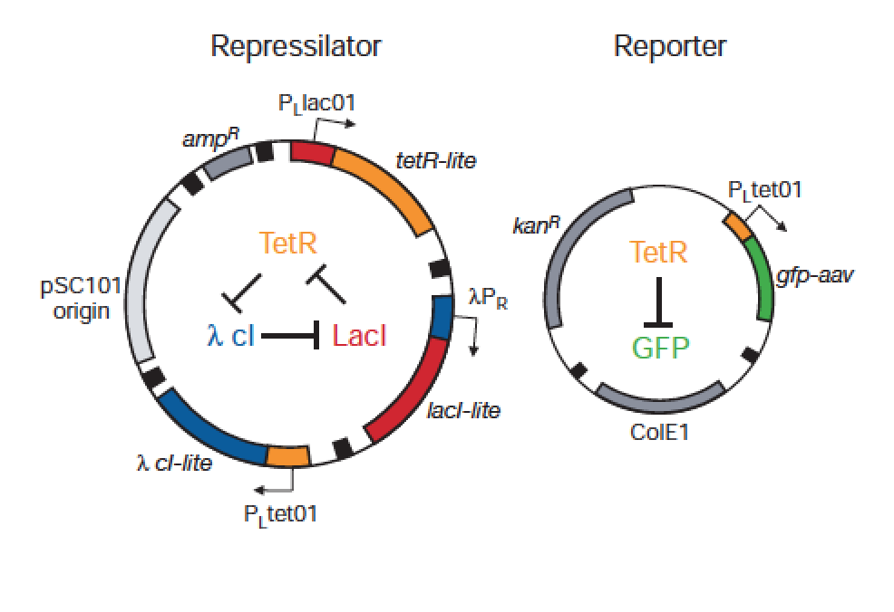

---

```{r setup, include=FALSE}
# set up environment and import libraries
knitr::opts_chunk$set(echo = TRUE)
library (shiny)
library(deSolve)
```


```{r ini condition, echo=FALSE}
# set up initial conditions
#times<- seq(0,100,by=1)
ini_md1 <- c(x1=99, x2=1)
ini_md2 <- c(x1=99, x2=1, x3=0)
ini_md3 <- c(x1=99, x2=1, x3=0)
ini_md4 <- c(lacI=0.0, tetR=0.01, cI=0.0, LacI=0.0, TetR=0.0, CI=0.0)
```


```{r two-comp with backflow ode, echo=FALSE}
# model1: original model (two compartments with backflow)
model1 <- function(t, x, params){
  x1 = x[1]
  x2 = x[2]
  
  b = params[1]
  a = params[2]
  
  dx1 = -b*x1*x2+a*x2
  dx2 = b*x1*x2-a*x2
  
  list(c(dx1, dx2))
}
```


```{r three-comp, echo=FALSE}
# model2: alternative model1 (three compartments)
model2 <- function(t, x, params){
  x1 = x[1]
  x2 = x[2]
  x3 = x[3]
  
  b = params[1]
  r = params[2]
  
  dx1 = -b*x1*x2
  dx2 = b*x1*x2-r*x2
  dx3 = r*x2
  
  list(c(dx1, dx2, dx3))
}
```


```{r three-comp with backflow ode, echo=FALSE}
# model3: alternative model2 (three compartments with backflow)
model3 <- function(t, x, params){
  x1 = x[1]
  x2 = x[2]
  x3 = x[3]
  
  b = params[1]
  a = params[2]
  r = params[3]
  
  dx1 = -b*x1*x2+a*x3
  dx2 = b*x1*x2-r*x2
  dx3 = r*x2-a*x3
  
  list(c(dx1, dx2, dx3))
}
```


```{r repressor model, echo=FALSE}
## model equations
model4 <- function(t, x, params){
  mi = matrix(c(x[1],x[2],x[3]))
  pi = matrix(c(x[4],x[5],x[6]))
  mol_ind = c(1,2,3) #make an index list to indiciate each repressor
  mol_indr = c(3,1,2) #make an index list to indicate each receiver
  
  a = params[1]
  a0 = params[2]
  b = params[3]
  n = params[4]
  
  dmi = matrix(rep(0,3))
  dpi = matrix(rep(0,3))
  for (i in mol_ind){
    dmi[i] = -mi[i]+(a/(1+pi[mol_indr[i]]^n))+a0
    dpi[i] = -b*(pi[i]-mi[i])
  }
  
  list(c(dmi, dpi))
}
```


### Two compartment model with backflow

```{r model1 fig, out.width = "240px", echo=FALSE}
knitr::include_graphics("figure/sis_model.png")
```
<br /> <br />

```{r interface m1, echo=FALSE}
inputPanel(
sliderInput("times1", label = "time steps:", 
              min = 0, max = 200, value = 20, step = 1),
sliderInput("b1", label = "b:",
              min = 0.0, max = 0.3, value = 0.01, step = 0.005),
sliderInput("a1", label= "a:",
              min = 0.0, max = 3.5, value = 0.65, step= 0.005)
)
```

```{r backend m1, echo=FALSE}
renderPlot({
## model simulation
res_md1<- as.data.frame(ode(y=ini_md1, times=seq(0,input$times1,1), func=model1, parms=c(input$b1, input$a1), method="ode45"))
matplot(res_md1$time, as.data.frame(c(res_md1[2],res_md1[3])), type='l', xlab='time', ylab='counts', lwd=5, bty='l', col=c(1,3), cex.lab=1.3, cex.axis=1.1, ylim=c(0, 130))
legend("top",c("x1", "x2"), col=c(1,3),bty="n", horiz=TRUE, lwd=4, lty=1:3,cex=1.2 )
})
```


### Three compartment model:

```{r model2 fig, out.width = "400px", echo=FALSE}
knitr::include_graphics("figure/sir_model.png")
```
<br /> <br />

```{r interface m2, echo=FALSE}
inputPanel(
sliderInput("times2", label = "time steps:", 
              min = 0, max = 200, value = 20, step = 1),
sliderInput("b2", label = "b:",
              min = 0.0, max = 0.3, value = 0.01, step = 0.005),
sliderInput("r2", label= "r:",
              min = 0.0, max = 0.3, value = 0.01, step= 0.005)
)
```

```{r backend m2, echo=FALSE}
renderPlot({
## model simulation
res_md2<- as.data.frame(ode(y=ini_md2, times=seq(0,input$times2,1), func=model2, parms=c(input$b2, input$r2), method="ode45"))
matplot(res_md2$time, as.data.frame(c(res_md2[2],res_md2[3], res_md2[4])), type='l', xlab='time', ylab='counts', lwd=5, bty='l', col=c(1,3,4), cex.lab=1.3, cex.axis=1.1, ylim=c(0, 130))
legend("top",c("x1", "x2", "x3"), col=c(1,3,4),bty="n", horiz=TRUE, lwd=4, lty=1:4,cex=1.2 )
})
```


### Three compartment model with backflow

```{r model3 fig, out.width = "400px", echo=FALSE}
knitr::include_graphics("figure/sirs_model.png")
```
<br /> <br />

```{r interface m3, echo=FALSE}
inputPanel(
sliderInput("times3", label = "time steps:", 
              min = 0, max = 200, value = 20, step = 1),
sliderInput("b3", label = "b:",
              min = 0.0, max = 0.3, value = 0.01, step = 0.005),
sliderInput("a3", label= "a:",
              min = 0.0, max = 3.5, value = 0.01, step= 0.005),
sliderInput("r3", label= "r:",
              min = 0.0, max = 0.3, value = 0.01, step= 0.005)
)
```

```{r backend m3, echo=FALSE}
renderPlot({
## model simulation
res_md3<- as.data.frame(ode(y=ini_md3, times=seq(0,input$times3,1), func=model3, parms=c(input$b3, input$a3, input$r3), method="ode45"))
matplot(res_md3$time, as.data.frame(c(res_md3[2],res_md3[3], res_md3[4])), type='l', xlab='time', ylab='counts', lwd=5, bty='l', col=c(1,3,4), cex.lab=1.3, cex.axis=1.1, ylim=c(0, 130))
legend("top",c("x1", "x2", "x3"), col=c(1,3,4),bty="n", horiz=TRUE, lwd=4, lty=1:4,cex=1.2 )
})
```


### A synthetic oscillatory network of transcriptional regulators

```{r model4 fig, out.width = "400px", echo=FALSE}

```
<br /> <br />

```{r interface m4, echo=FALSE}
inputPanel(
sliderInput("b4", label = "beta:",
              min = 0.0, max = 50.0, value = 5.0, step = 1.0),
sliderInput("a4", label= "alpha:",
              min = 10.0, max = 500.0, value = 216.0, step= 1.0),
sliderInput("a0_4", label= "alpha0:",
              min = 0.0, max = 1, value = 0.216, step= 0.001),
sliderInput("n", label= "n:",
              min = 1, max = 6, value = 2, step= 1)
)
```

```{r backend m4, echo=FALSE}
renderPlot({
## rescale factors
#k_m = log(2.0)/120.0
k_p = log(2.0)/600.0
tcp_efficiency = 20.0
k_b = 1600.0
scalar_rna = k_p/(tcp_efficiency*(k_b**(1.0/input$n)))
scalar_protein = k_b**(1.0/input$n)
## model simulation
res_md4<- as.data.frame(ode(y=ini_md4, times=seq(0,800, by=8), func=model4, parms=c(input$a4,input$a0_4,input$b4, input$n), method="ode45"))
## plot simulation
matplot(res_md4$time, as.data.frame(c(res_md4[5]*scalar_protein,res_md4[6]*scalar_protein, res_md4[7]*scalar_protein)),ylim = c(0,7500), type='l', xlab='time', ylab='proteins per cell', lwd=3, bty='l', cex.lab=1.3, cex.axis=1.1)
legend("top",c("lacI", "tetR","cI"), col=1:3,bty="n", horiz=TRUE, lwd=2, lty=1:4,cex=1.2 )
})
```
